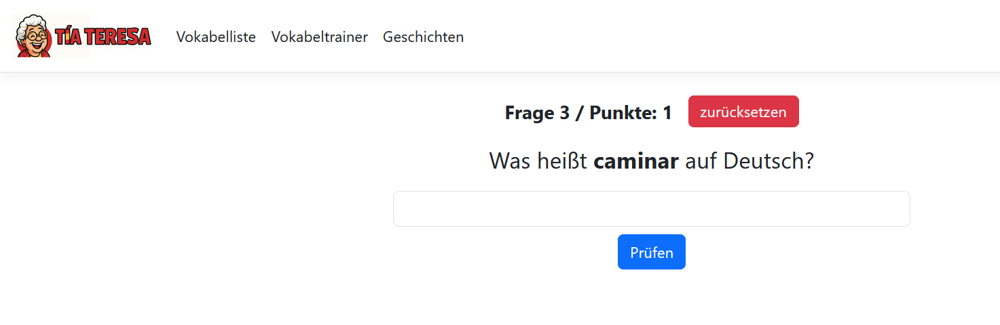

# TiaTeresa

Webanwendung, entwickelt im Rahmen des ASP.NET-Seminars.

**TiaTeresa** ist eine Spanisch-Lernplattform, die als Hobby-Projekt parallel zum ASP.Net Kurs an der Akademie Dr.Heuer entwickelt wird. Die Webapplikation wird modular um Funktionen ergänzt. 

Aktuell:
-  **Vokabeltrainer** mit systematischem Aufbau
-  **Kurzgeschichten** auf Spanisch mit deutscher Übersetzung per Tooltip

---

## Verwendete Technologien

- ASP.NET Core MVC
- Entity Framework Core
- Bootstrap
- JavaScript (DOM-Manipulation, Hover-Effekte)
- SQLite / SQL Server (je nach Einsatz)

---

## Features

- Benutzer-Login und Fortschrittsspeicherung
- Lückentests und Multiple-Choice-Vokabeltrainer
- Kurzgeschichten mit satzweiser Übersetzung
- Administrationsbereich zum Verwalten von Inhalten

