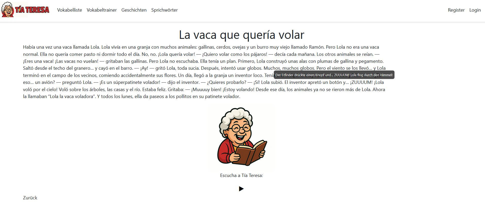

# Tia Teresa

**TiaTeresa** ist eine Spanisch-Lernplattform, die von mir als Hobby-Projekt parallel zum ASP.Net und Azure Developer Associate Seminarblock an der Akademie Dr.Heuer entwickelt wird. Die Webapplikation wird modular um Funktionen ergänzt. 

Aktuell:
-  **Vokabeltrainer** 
-  **Kurzgeschichten** auf Spanisch mit deutscher Übersetzung per Tooltip und Vorlesefunktion
-  **Admin-Bereich** CRUD-Funktionen auf einen Admin-Bereich ausgelagert
-  **Vokabeltest** mit Punkten
-  **Zahlen** Zahlentest mit Audiofunktion
-  **Sprichwörter** mit Übersetzung und Erklärung
-  **Sightseeing** Historische und Interessante Orte mit Beschreibung und Bebilderung. Navigation über Karte.
-  **Startseite** Startseite mit zufälligen Inhalten und einer Vorstellung der Anwendung. Aktuell in Bearbeitung.

---
## Live-Demo  
[Tia Teresa](https://tia-teresa.azurewebsites.net/)

---

## Verwendete Technologien

- ASP.NET Core MVC
- Entity Framework Core
- Bootstrap
- JavaScript (DOM-Manipulation, Hover-Effekte)
- SQLite / SQL Server (je nach Einsatz)
- Leaflet API für die Karte
- TTS-Audio mit Elevenlabs

---

## Anstehende Updates

- Sightseeing: Überarbeitung der Detail-View
- Persönlicher Userbereich mit individuellen Inhalten
- Passwort-Rücksetzung

